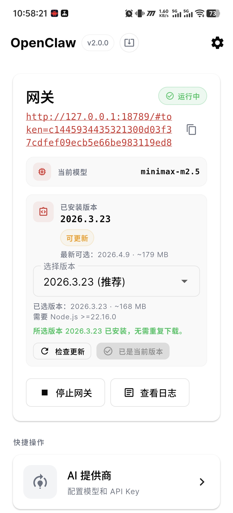
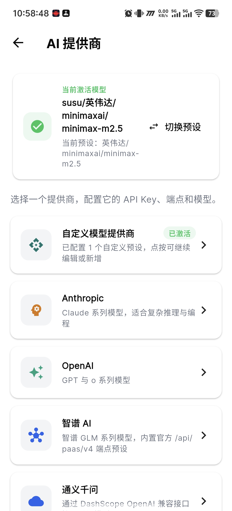
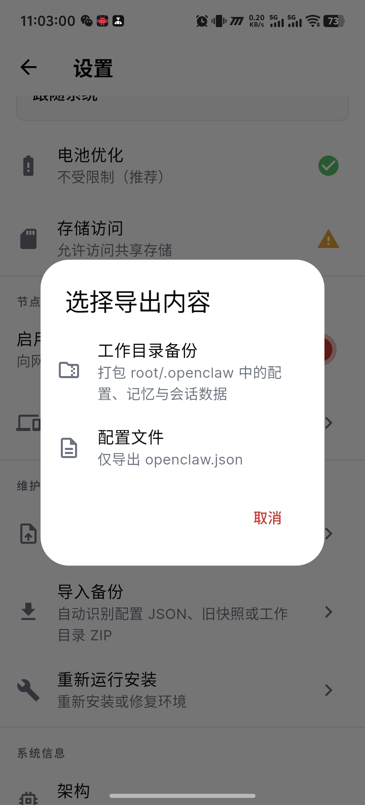

<div align="center">
  
  <h1>OpenClaw 中文整合版</h1>
  <p>
    <a href="README.md">简体中文</a> | <a href="docs/README_en.md">English</a>
  </p>
  <p>面向中文用户维护与分发的 OpenClaw Android 独立整合版本</p>
  <p>内置 Ubuntu RootFS、Node.js、OpenClaw 安装与管理能力，重点优化中文文档、移动端配置体验与 Android 原生集成。</p>
  <p>
    
    
    
    
  </p>
  <p>
    
    
    
    
    
    
  </p>
</div>

> 本仓库为社区维护的中文整合版，主要用于中文用户维护、测试与分发。
>
> 整合来源：
> - Android 集成上游：[`mithun50/openclaw-termux`](https://github.com/mithun50/openclaw-termux)
> - 汉化基础分支：[`TIANLI0/openclaw-termux` 的 `feature/translation` 分支](https://github.com/TIANLI0/openclaw-termux/tree/feature/translation)
> - OpenClaw 核心项目：[`openclaw/openclaw`](https://github.com/openclaw/openclaw)

## 项目定位

这个仓库的目标不是简单把 OpenClaw 打成 APK，而是让中文 Android 用户更容易完成以下事情：

- 在手机上直接安装 Ubuntu RootFS、Node.js 与 OpenClaw，不依赖 Termux。
- 用中文界面完成初始化、配置、日志查看、版本切换和备份恢复。
- 在 Android 上管理 AI 提供商、消息平台、网关和节点能力。
- 更直观地编辑 `openclaw.json`、查看对话日志和恢复记忆/会话数据。

## 重要警告

> [!IMPORTANT]
> - **本仓库不是 OpenClaw 官方 Android 发布渠道，升级前请自行评估兼容性与风险**。
> - 首次安装会下载并解压 Ubuntu RootFS、Node.js 与 OpenClaw，务必保证网络、存储空间和前台运行时间足够。
> - 导入配置或工作目录备份时，会覆盖当前 `/root/.openclaw` 下的核心数据；恢复前请先确认自己是否需要另做备份。
> - 节点能力中的 `Canvas` 目前仍是未实现状态，README 会展示能力规划，但这项功能现在不能当成已可用能力使用。
> - 如果要长时间运行 Gateway、做局域网访问或后台保持会话，建议**关闭系统电池优化**，并正确授予存储等必要权限。

## 功能亮点

- 一键安装 Android 独立运行环境：Ubuntu RootFS、Node.js、OpenClaw。
- 中文首页与安装向导，可直接选择 OpenClaw 版本并完成初始化。
- AI 提供商管理、消息平台接入、可选组件安装、节点能力配置。
- 首页快捷操作新增“本地模型和对话”与“备份中心”，更适合手机上直接操作。
- 支持在手机上安装 `llama.cpp`、下载和管理 GGUF 模型、写入本地 Provider 预设，并直接进入本地对话页测试。
- 本地对话页支持流式输出、思考开关、Markdown 渲染、停止生成、折叠头部、内存占用查看和切换其他已保存模型配置。
- 支持配置文件编辑、对话日志查看、备份导出、备份库切换与工作目录恢复。
- 支持局域网访问说明、节点日志复制、结构化对话日志展示等移动端优化。
- 支持全架构 APK 打包，便于真机与模拟器测试。

## 界面截图

<table>
  <tr>
    <td align="center"><br />首页</td>
    <td align="center"><br />AI 提供商</td>
    <td align="center"><br />消息平台</td>
    <td align="center"><br />可选组件</td>
  </tr>
  <tr>
    <td align="center"><br />节点能力</td>
    <td align="center"><br />配置文件编辑</td>
    <td align="center"><br />导出备份</td>
    <td align="center"><br />WebUI 对话界面</td>
  </tr>
</table>

## 节点能力

当前 Android 端已经围绕“设备能力接入 Gateway”做了基础支持，能力状态如下：

| 能力 | 状态 | 说明 |
| --- | --- | --- |
| Camera | ✅ 已接入 | 拍照和视频片段采集 |
| Location | ✅ 已接入 | 获取设备 GPS 坐标 |
| Screen Recording | ✅ 已接入 | 录制设备屏幕，每次都需要授权 |
| Flashlight | ✅ 已接入 | 控制手电筒开关 |
| Vibration | ✅ 已接入 | 触发振动和触觉反馈 |
| Sensors | ✅ 已接入 | 读取加速度计、陀螺仪、磁力计、气压计等 |
| Serial | ✅ 已接入 | 蓝牙和 USB 串口通信 |
| Canvas | ⏳ 暂未启用 | 当前 Android 端 WebView Canvas capability 仍未实现 |

补充说明：

- 节点页支持本地网关和远程网关两种连接方式。
- 已加入节点日志查看与复制，方便排查连接和配对问题。
- `Canvas` 在代码里是明确返回 `NOT_IMPLEMENTED` 的占位实现，不是隐藏入口。

## 架构图

下面是这个整合版的大致结构：

<div align="center">
  
</div>

可以简单理解为：

- `flutter_app/` 负责 Android 端 UI、权限、安装流程和原生能力桥接。
- PRoot 里的 Ubuntu 负责承载 Node.js 与 OpenClaw CLI / Gateway 运行环境。
- `/root/.openclaw` 负责保存配置、记忆、技能、扩展和会话等核心数据。
- 节点能力是 Android 设备侧的补充能力层，通过配对后向 Gateway 暴露设备能力。

## 当前正式发布版本

- 版本：`v2.0.1`
- 发布说明：[release/v2.0.1/Release.zh.md](release/v2.0.1/Release.zh.md)
- 改动日志：[CHANGELOG.md](CHANGELOG.md)
- Releases 页面：<https://github.com/JunWan666/openclaw-termux-zh/releases>

> 不确定版本该下哪个时，请优先以 GitHub Releases 页面为准。

## v2.0.1 重点亮点

- 修复 AI 提供商里“自定义模型”串到其他渠道的问题，现在每个提供商的模型值都会独立保存。
- 对话日志改为直接读取应用工作目录里的 `.jsonl` 会话文件，规避旧的 `resolv.conf` 缺失问题。
- 首页快捷操作新增“本地模型和对话”，可直接安装 `llama.cpp`、管理已下载模型、进入本地对话。
- 内置 GGUF 模型列表、联网搜索和 Gemma 4 热门模型推荐，不再要求自己到处找链接。
- 本地对话页支持切换本地模型、已保存 Provider 配置和手动接口，也支持流式、思考、Markdown 和停止生成。
- 备份入口升级为“备份中心”，统一管理导入、保存、切换、恢复和导出备份。

## 下载指南

> 不确定手机架构时，优先下载 `universal.apk`。

| 文件 | 适用设备 | 大小 | 下载 |
| --- | --- | ---: | --- |
| `OpenClaw-v2.0.1-universal.apk` | 不确定架构、想直接安装 | 102.06 MB | [点击下载](https://github.com/JunWan666/openclaw-termux-zh/releases/download/v2.0.1/OpenClaw-v2.0.1-universal.apk) |
| `OpenClaw-v2.0.1-arm64-v8a.apk` | 大多数现代 Android 手机 | 83.80 MB | [点击下载](https://github.com/JunWan666/openclaw-termux-zh/releases/download/v2.0.1/OpenClaw-v2.0.1-arm64-v8a.apk) |
| `OpenClaw-v2.0.1-armeabi-v7a.apk` | 较老的 32 位 ARM 设备 | 83.53 MB | [点击下载](https://github.com/JunWan666/openclaw-termux-zh/releases/download/v2.0.1/OpenClaw-v2.0.1-armeabi-v7a.apk) |
| `OpenClaw-v2.0.1-x86_64.apk` | 模拟器或 x86_64 设备 | 84.01 MB | [点击下载](https://github.com/JunWan666/openclaw-termux-zh/releases/download/v2.0.1/OpenClaw-v2.0.1-x86_64.apk) |
| `OpenClaw-v2.0.1.aab` | 应用商店分发 | 108.84 MB | [点击下载](https://github.com/JunWan666/openclaw-termux-zh/releases/download/v2.0.1/OpenClaw-v2.0.1.aab) |

## 快速开始

### 方式一：Android APK（推荐）

1. 从上方“下载指南”中选择适合自己设备的 APK。
2. 安装后打开应用，并授予必要权限。
3. 如需指定 OpenClaw 版本，可在安装页顶部选择版本后再点击“开始安装”。
4. 完成 Onboarding、AI 提供商与 API Key 配置。
5. 启动 Gateway。
6. 点击首页地址，或在浏览器访问 `http://127.0.0.1:18789` 打开 Web 控制台。

### 方式二：源码构建

```bash
git clone https://github.com/JunWan666/openclaw-termux-zh.git
cd openclaw-termux-zh/flutter_app
flutter pub get
flutter build apk --release
```

如需直接生成发布目录中的 APK / AAB，可使用仓库自带脚本：

```bash
python scripts/build_release.py --version 2.0.1 --build-number 68
```

## 交流反馈

如需交流使用经验、排查问题或反馈建议，欢迎加入 `OpenClaw-zh` 开源项目交流群。

<div align="center">
  
  <p>微信扫码加入交流群</p>
</div>

## 更多文档

- [CHANGELOG.md](CHANGELOG.md)
- [docs/jsonl_format_guide.md](docs/jsonl_format_guide.md)
- [docs/README_en.md](docs/README_en.md)
- [release/v2.0.1/Release.zh.md](release/v2.0.1/Release.zh.md)

## Star History

[](https://star-history.com/#JunWan666/openclaw-termux-zh&Date)

## 免责声明

本仓库为社区维护的中文整合版本，不代表 OpenClaw 官方发布。若用于生产环境，请自行评估兼容性、升级风险与数据安全策略。

## 许可证

MIT，详见 [LICENSE](LICENSE)。
